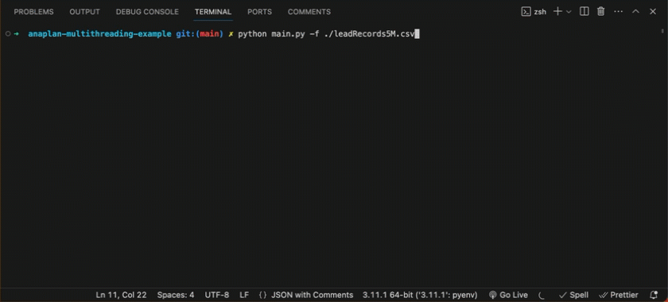
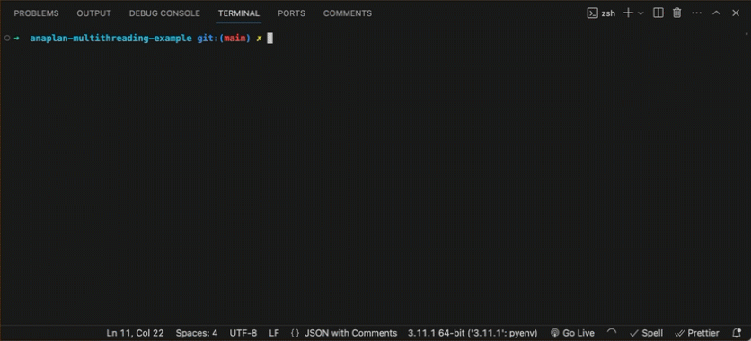

# Anaplan REST API Multithreading Python Example

## Description
Demonstrates using the Anaplan REST API with multithreading to speed up the upload of data. The example also demonstrates logging in with basic authentication, S/MIME certificates, as well as device-based OAuth. 

A link to the GitHub repository can be viewed [here](https://github.com/qkeddy/anaplan-multithreading-example).

## Table of Contents

- [Deployment](#deployment)
- [Features](#features)
- [Usage](#usage)
- [Tests](#tests)
- [Credits](#credits)
- [License](#license)
- [How to Contribute](#how-to-contribute)

## Deployment
1. Fork and clone project repo
3. Using `pip install`, download and install the following Python libraries
`pandas`, `pytz`, `pyjwt`, `requests`, `pycryptodome` and `apsw`.
4. Review the `settings.json` file and set the following values: 
    - Set the Workspace and Model IDs
    - Set the `"authenticationMode"` to either `basic`, `cert_auth`, or `OAuth` (case-sensitive).
    - If using `basic`, then use the command line switches `-u` with your Anaplan username and `-p` with the corresponding password. 
    - If using `cert_auth`, then provide proper paths and the filename of the Public Certificate and the Private Key. If you have a passphrase for your private key, then insert it after the filename separated by a `:`.   Note that both files need to be in a PEM format. Please see the [Interactive Certificate Authority (CA) certificate guide](https://support.anaplan.com/interactive-certificate-authority-ca-certificate-guide-437d0b63-c0be-4650-9711-0d3370593697), if you need to convert your MIME certificates to the required format to support Anaplan Certificate authentication.
    - If using `OAuth`, set the `"rotatableToken"` key to either `true` or `false` depending on how your `Device Grant OAuth Client` has been configured in the Anaplan Administrative Console. Note this implementation only supports Device Grant OAuth Clients and not Authorization Code Grants. Please create an Anaplan device authorization code grant. More information is available [here](https://help.anaplan.com/2ef7b883-fe87-4194-b028-ef6e7bbf8e31-OAuth2-API). If `"rotatableToken"` is set to `true`, then it is recommended that the `Refresh token lifetime` is set to a longer duration than the default 43,200 seconds. Using the default require an end-user to re-authenticate the device after 12 hours. 
    - Set the `"accessTokenTtl` time to live to a value less than 2100 seconds. Note that the Anaplan Access Token can have a maximum TTL of 35 minutes (2100 seconds). If there is a desire to see the access token get refreshed more often, then simply set this to a lower value. 
    - Toggle `"verboseEndpointLogging"` to see the actual REST API URIs 
    - Control the number of threads (maximum 200) with the `"threadCount"` parameter.
    - Control if the chunks are compressed in GZip format or plain text with the `"compressUploadChunks"`. This is a good way to see the performance impact of compression.
    - Control the upload chunk size in megabytes with the `"uploadChunkSizeMb"` parameter. The value must be between 1 and 50.
    - Control if the upload chunks are deleted when the process is complete with the `"deleteUploadChunks"` parameter. 

## Features
- Demonstrates accelerated upload performance with multithreading. 
- Demonstrates chunking at line breaks versus splitting in the middle of a record. 
- Provides the ability to control number of concurrent threads (maximum 200), chunk size, and toggling compression on & off
- Dynamically creates a new `access_token` using a `refresh_token` on an independent worker thread.

## Usage

1. If using basic authentication, then please start the Python script with the arguments `-u` and `-p` followed by your username and password.
    - Example: `python .\main.py -u your_user_name -p your_password -f .\myfile_to_upload.csv`. Note that the example below is using OAuth, so a username and password is not requried.

2. When executing the first time and using OAuth on a particular device, open the CLI in the project folder and run `python3 main.py -r -c <<enter Client ID>>`. 

3. After the above step, the script can be executed unattended by simply executing `python3 main.py -f .\myfile_to_upload.csv`.

Note: The `client_id` and `refresh_token` are stored as encrypted values in a SQLite database. As an alternative, a solution like [auth0](https://auth0.com/) would further enhance security. 

4. To see all command line arguments, start the script with `-h`.

5. To update any of the Anaplan API URLs, please edit the file `settings.json`.

## Tests
Currently, no automated unit tests have been built. 

## Credits
- [Quinlan Eddy](https://github.com/qkeddy)

## License
MIT License

Copyright (c) 2022 Quin Eddy

Permission is hereby granted, free of charge, to any person obtaining a copy
of this software and associated documentation files (the "Software"), to deal
in the Software without restriction, including without limitation the rights
to use, copy, modify, merge, publish, distribute, sublicense, and/or sell
copies of the Software, and to permit persons to whom the Software is
furnished to do so, subject to the following conditions:

The above copyright notice and this permission notice shall be included in all
copies or substantial portions of the Software.

THE SOFTWARE IS PROVIDED "AS IS", WITHOUT WARRANTY OF ANY KIND, EXPRESS OR
IMPLIED, INCLUDING BUT NOT LIMITED TO THE WARRANTIES OF MERCHANTABILITY,
FITNESS FOR A PARTICULAR PURPOSE AND NONINFRINGEMENT. IN NO EVENT SHALL THE
AUTHORS OR COPYRIGHT HOLDERS BE LIABLE FOR ANY CLAIM, DAMAGES OR OTHER
LIABILITY, WHETHER IN AN ACTION OF CONTRACT, TORT OR OTHERWISE, ARISING FROM,
OUT OF OR IN CONNECTION WITH THE SOFTWARE OR THE USE OR OTHER DEALINGS IN THE
SOFTWARE.

## How to Contribute

If you would like to contribute to this project. Please email me at qkeddy@gmail.com. If you would like to contribute to future projects, please follow me at https://github.com/qkeddy.

It is requested that all contributors adhere to the standards outlined in the [Contributor Covenant Code of Conduct](https://www.contributor-covenant.org/version/2/1/code_of_conduct/).